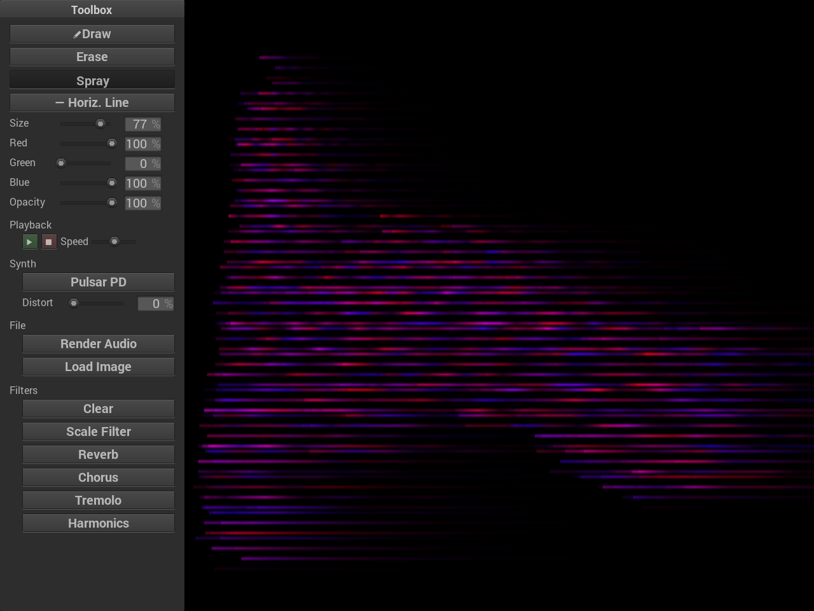

Canvas (working title) is a visual additive synthesizer that is controlled by editing an image. Scribble on the canvas and use a variety of image filters to create new and interesting sounds. Canvas is heavily inspired by [MetaSynth](https://uisoftware.com/metasynth/) and [Virtual ANS](https://warmplace.ru/soft/ans/) and aspires to offer an open source, cross-platform addition to the graphical synthesizer space.

Canvas currently uses 239 sine waves spaced at quarter tones, and offers rudimentary drawing features and several image-based audio filters such as reverb, chorus, and tremolo. Stereo is supported by using red and blue for the right and left channels, respectively. The sine waves can be morphed into other waveforms using [phase distortion synthesis](https://en.wikipedia.org/wiki/Phase_distortion_synthesis).

This software is built on PortAudio, libsndfile, SDL2, FFTW, [stb](https://github.com/nothings/stb/), and [NanoGUI-SDL](https://github.com/dalerank/nanogui-sdl/).

## Installation

For Windows, builds are provided on the Release page.

For Linux and macOS, you must build yourself using instructions below.

On Linux, you must also have the Zenity tool installed and in your PATH. Otherwise the "Browse" buttons will not work:

    sudo apt install zenity  # Debian
    sudo pacman -S zenity  # Arch

## Building

### Windows

You will need to install CMake and Visual Studio. The below instructions use VS 2019, but will likely work for older versions with appropriate minor changes. MinGW is not yet supported.

Download and unzip the following and place them somwhere safe:

- ASIO SDK
- FFTW3
- libsndfile
- Development libraries for SDL2, SDL2_image, and SDL2_ttf

The FFTW3 library needs a little preparation by generating a .lib file:

    call "C:\Program Files (x86)\Microsoft Visual Studio\2019\Community\VC\Auxiliary\Build\vcvars64.bat"
    cd <path to FFTW3>
    lib.exe /machine:x64 /def:libfftw3f-3.def

To build, run the following:

    mkdir build
    cd build

    # For the -G option, use cmake --help and scroll down to the list of
    # Visual Studio versions. Find the string that matches the one you currently
    # have installed.
    cmake .. -G "Visual Studio 16 2019" -A x64 \
        -DASIOSDK_ROOT_DIR=<path to ASIO SDK> \
        -DSDL2_LIBRARY=<path to SDL2>/lib/x64/SDL2.lib \
        -DSDL2_INCLUDE_DIRS=<path to SDL2>/include/ \
        -DSDL2_IMAGE_PATH=<path to SDL2_image> \
        -DSDL2_TTF_PATH=<path to SDL2_ttf> \
        -DSNDFILE_PATH=<path to libsndfile> \
	-DFFTW_ROOT=<path to FFTW> \

    cmake --build . --config Release

    # NOTE: The following manual copies will be automated in CMake soon
    cd Release
    cp <path to FFTW3>/libfftw3f-3.dll .
    cp <path to SDL2>/lib/x64/SDL2.dll .
    cp <path to SDL2_image>/lib/x64/SDL2_image.dll .
    cp <path to SDL2_image>/lib/x64/zlib1.dll .
    cp <path to SDL2_ttf>/lib/x64/SDL2_ttf.dll .
    cp <path to SDL2_ttf>/lib/x64/libfreetype-6.dll .
    cp <path to libsndfile>/bin/sndfile.dll .

Then run `./Release/canvas`.

### Linux

Debian/Ubuntu:

    sudo apt install build-essential cmake libsdl2-dev libsdl2-image-dev libsdl2-ttf-dev portaudio19-dev libsndfile1-dev libfftw3-dev

Arch:

    sudo pacman -S cmake sdl2 sdl2_image sdl2_ttf portaudio libsndfile fftw

Build on Linux:

    mkdir build
    cd build
    cmake -DCMAKE_BUILD_TYPE=Release ..

The run `./canvas`.

### macOS

Install some dependencies:

    brew install cmake sdl2 sdl2_image sdl2_ttf portaudio libsndfile

I had trouble with the fftw homebrew package (at least on M1), so here's how to build it yourself:

    wget https://www.fftw.org/fftw-3.3.9.tar.gz
    tar -xzf fftw-3.3.9.tar.gz
    cd fftw-3.3.9
    ./configure --enable-float
    make
    sudo make install

To build:

    mkdir build
    cd build
    cmake -DCMAKE_BUILD_TYPE=Release ..
    make

Then run `./canvas`.

## Running tests

    git lfs checkout
    pytest tests --executable <executable>
